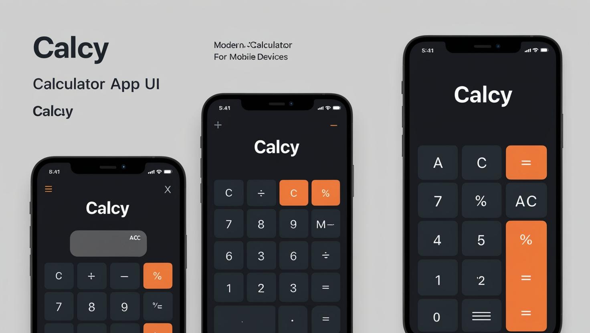

Calcy App
A Fast, Responsive Calculator Web Application

  

  

🚀 Overview
Calcy App is a simple yet powerful calculator web app designed for speed and efficiency.
Built with HTML, CSS, and JavaScript, it features a minimalistic UI, smooth interactions, and responsive design for an excellent user experience across all devices.

✨ Features
➕ Addition, ➖ Subtraction, ✖️ Multiplication, ➗ Division

🎹 Keyboard and On-Screen Button input

📱 Responsive Layout — perfect for mobile, tablet, and desktop

🚫 Error Handling for invalid inputs

🎨 Clean, Minimal, and Elegant design

🛠️ Tech Stack

(Optionally: React.js if used)

📸 Screenshots

  

🚀 Getting Started
Create a directory and move into it
bash
Copy
Edit
mkdir calci-app
cd calci-app
Clone and setup Calcy App
bash
Copy
Edit
git clone https://github.com/your-username/calci-app.git
cd calci-app
Open the Application
Open index.html directly in your preferred web browser.

You can double-click or right-click → Open with Browser.

🛠 Development Mode (Optional, if React/Webpack used)
bash
Copy
Edit
# Install dependencies
npm install

# Start the development server
npm start
# or
yarn start
The app will be available at: http://localhost:3000 🚀

📦 Production Build
Create a production-ready optimized build:

bash
Copy
Edit
npm run build
# or
yarn build
🎉 Live Demo
(Add your deployed site link here if available!)
Example: Live Calcy App

❤️ Contributing
Contributions are what make the open-source community such an amazing place to learn, inspire, and create.
Feel free to fork the repo and submit a pull request!

  

⚡ Happy Coding! ⚡
